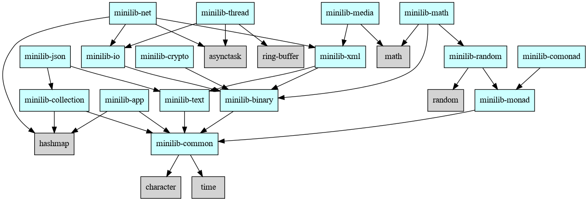

## Overview

Minilib is a small library for [FixLang](https://github.com/tttmmmyyyy/fixlang).
The latest Fix program (2024/11/19) is required.
This library is still in alpha stage.

Currently only Linux (x86_64, aarch64) is supported. MacOS is not supported yet.

## Subprojects

Minilib is split into several FixLang subprojects whose names start with `minilib-`.

Each subproject is stored in a separated GitHub repository whose names start with `fixlang-minilib-`.
For example, `minilib-common` is stored in [fixlang-minilib-common](https://github.com/pt9999/fixlang-minilib-common) repository.

### List of subprojects

| Name   | Description |
|--------|-------------|
|[minilib-common](https://github.com/pt9999/fixlang-minilib-common)| Common modules (StringEx, UnitTest etc.)|
|[minilib-text](https://github.com/pt9999/fixlang-minilib-text)| Text handling (SimpleParser, Unicode etc.)|
|[minilib-binary](https://github.com/pt9999/fixlang-minilib-binary)| Binary handling|
|[minilib-io](https://github.com/pt9999/fixlang-minilib-io)| IO operations (File System, Platform Info)|
|[minilib-collection](https://github.com/pt9999/fixlang-minilib-collection)| Collections  (Red-Black tree, Double-ended queue etc.)|
|[minilib-monad](https://github.com/pt9999/fixlang-minilib-monad)| Monads (State/Reader/Writer monad, Monad transformer etc.)|
|[minilib-comonad](https://github.com/pt9999/fixlang-minilib-comonad)| Comonads (Env/Traced comonad etc.)|
|[minilib-thread](https://github.com/pt9999/fixlang-minilib-thread)| Multithreading (Task pool etc.) |
|[minilib-net](https://github.com/pt9999/fixlang-minilib-net)| Networks (TCP/IP, HTTP etc.) |
|[minilib-math](https://github.com/pt9999/fixlang-minilib-math)| Math (Complex number, BigInt, BigFloat, Algebra etc.)|
|[minilib-crypto](https://github.com/pt9999/fixlang-minilib-crypto)| Cryptography  (AES, SHA-1, SHA-256, HMAC etc.)|
|[minilib-app](https://github.com/pt9999/fixlang-minilib-app)| Application Support (CommandLine parser etc.) |
|[minilib-media](https://github.com/pt9999/fixlang-minilib-media)| Multimedia (PNG image etc.) |
|[minilib-json](https://github.com/pt9999/fixlang-minilib-json)| JSON encoder/decoder |
|[minilib-xml](https://github.com/pt9999/fixlang-minilib-xml)| XML encoder/decoder |

### Subproject dependency diagram



### Example programs

Minilib's Example programs are stored in a separated repository.

For details, see README.md in [fixlang-minilib-examples](https://github.com/pt9999/fixlang-minilib-examples).

### Registy File

You might want to add [registry.toml](registry.toml) to your `${HOME}/.fixproj.toml`.
For example:
```toml:~/.fixproj.toml
registries = [
    "https://raw.githubusercontent.com/pt9999/fixlang_minilib/refs/heads/main/registry.toml"
]
```

Then, you can specify the names of subprojects in `fix deps add` command.
For example:
```bash
fix deps add minilib-common minilib-binary
```

## Target Platform

- x86_64-linux-gnu
- aarch64-linux-gnu
- NOTE: Currently MacOS is not supported.

It has been mainly tested in the following environment.

- Ubuntu-22.04 on WSL 2
- gcc 11.4.0
- GNU make 4.3
- rustup 1.26.0
- rustc 1.72.1
- llvm 12.0.1
- latest Fix program (2024/10/26)

## Minilib Development

This section describes how to develop Minilib.  If you are a Minilib user, you do not need to read this section.

### Directory structure

```
/_projects  ... Minilib subprojects are placed here as Git submodules
/_sandbox   ... Experimental source code (Not included in the library itself)
/tools      ... Tools code
```

### Fetch Git submodules

During Minilib development, Minilib subprojects are placed as Git submodules under the `_projects` directory.

To fetch all Git submodules from GitHub repositories, execute the following command:
```bash
git submodule update --init
```
This will clone the Git submodules from their respective GitHub repositories and place them in the `_projects` directory.

### Run test codes

To run test codes for all subprojects, execute the following command:
```bash
make test -C _projects
```

### Build example programs

To build example programs, execute the following command:
```bash
make examples -C _projects
```
