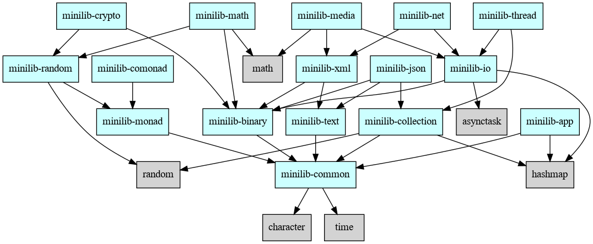

## Overview

Minilib is a small library for [FixLang](https://github.com/tttmmmyyyy/fixlang).
This library is still in alpha stage.

To use the latest Minilib, we recommend using the latest Fix v1.3.0-prealpha (2026-02-08+). 
For older Fix versions prior to v1.3.0, see the [Compatibility](#Compatibility) section below.

Currently only Linux (x86_64, aarch64) is supported. MacOS is not supported yet.

## Projects

Minilib is split into several FixLang projects whose names start with `"minilib-"`.
Each project is stored in a separated GitHub repository.

### How to use FixLang projects in your program

You can add dependencies using `fix deps add` command.

For example:
```bash
fix deps add minilib-common minilib-binary
```
### List of projects

| Name   | Description |
|--------|-------------|
|[minilib-common](https://github.com/pt9999/fixlang-minilib-common)| Common modules (UnitTest, Assertion, String extension etc.)|
|[minilib-text](https://github.com/pt9999/fixlang-minilib-text)| Text handling (SimpleParser, Unicode etc.)|
|[minilib-binary](https://github.com/pt9999/fixlang-minilib-binary)| Binary handling (ByteBuffer, BASE64, Hex string)|
|[minilib-io](https://github.com/pt9999/fixlang-minilib-io)| IO operations (File System, Platform Info etc.)|
|[minilib-collection](https://github.com/pt9999/fixlang-minilib-collection)| Collections (TreeSet, TreeMap, OrderedMap, Deque etc.)|
|[minilib-monad](https://github.com/pt9999/fixlang-minilib-monad)| Monads (State/Reader/Writer monad, Monad transformer etc.)|
|[minilib-comonad](https://github.com/pt9999/fixlang-minilib-comonad)| Comonads (Env/Traced comonad etc.)|
|[minilib-random](https://github.com/pt9999/fixlang-minilib-random)| Random monad etc. |
|[minilib-thread](https://github.com/pt9999/fixlang-minilib-thread)| Multithreading (Task pool, Channel etc.) |
|[minilib-net](https://github.com/pt9999/fixlang-minilib-net)| Networks (TCP/IP, HTTP etc.) |
|[minilib-math](https://github.com/pt9999/fixlang-minilib-math)| Math (Complex number, BigInt, BigFloat, Algebra etc.)|
|[minilib-crypto](https://github.com/pt9999/fixlang-minilib-crypto)| Cryptography (AES, SHA-1, SHA-256, HMAC etc.)|
|[minilib-app](https://github.com/pt9999/fixlang-minilib-app)| Application Support (CommandLine parser etc.) |
|[minilib-json](https://github.com/pt9999/fixlang-minilib-json)| JSON encoder/decoder |
|[minilib-xml](https://github.com/pt9999/fixlang-minilib-xml)| XML encoder/decoder |
|[minilib-media](https://github.com/pt9999/fixlang-minilib-media)| Multimedia (PNG image etc.) |

### Project dependency diagram

NOTE: Redundant dependencies and test-only dependencies are not displayed.



### Example programs

Minilib's Example programs are stored in a separated repository.

For details, see README.md in [fixlang-minilib-examples](https://github.com/pt9999/fixlang-minilib-examples).

### Compatibility

If you want to use Minilib with older versions of Fix program, you might need to use following Minilib projects.

### Compatible Minilib versions for Fix program v1.2.0
```
minilib-app = 0.6.2
minilib-binary = 0.5.6
minilib-collection = 0.6.6
minilib-common = 0.11.4
minilib-comonad = 0.5.9
minilib-crypto = 0.5.8
minilib-io = 0.7.2
minilib-json = 0.5.7
minilib-math = 0.6.8
minilib-media = 0.5.11
minilib-monad = 0.10.1
minilib-net = 0.6.8
minilib-random = 0.6.8
minilib-text = 0.7.3
minilib-thread = 0.6.1
minilib-xml = 0.5.7
```

### Compatible Minilib versions for Fix program v1.1.0-alpha.12
```
minilib-app = 0.5.1
minilib-binary = 0.5.1
minilib-collection = 0.6.0
minilib-common = 0.6.1
minilib-comonad = 0.5.1
minilib-crypto = 0.5.1
minilib-json = 0.5.1
minilib-math = 0.6.1
minilib-monad = 0.6.0
minilib-random = 0.5.2
minilib-text = 0.5.2
minilib-xml = 0.5.1
```

### Registy File

Minilib is registered in [default registry.toml file](https://raw.githubusercontent.com/tttmmmyyyy/fixlang-registry/refs/heads/main/registry.toml), so you don't have to edit your `${HOME}/.fixconfig.toml`.

<!--

In some case, you might want to add [registry.toml](registry.toml) to your `${HOME}/.fixconfig.toml`.
For example:
```toml:~/.fixconfig.toml
registries = [
    "https://raw.githubusercontent.com/pt9999/fixlang_minilib/refs/heads/main/registry.toml"
]
```
-->


## Target Platform

- x86_64-linux-gnu
- aarch64-linux-gnu
- NOTE: Currently MacOS is not supported.

It has been mainly tested in the following environment.

- Ubuntu-22.04 on WSL 2
- gcc 11.4.0
- GNU make 4.3
- rustup 1.28.2
- rustc 1.88.0
- llvm 17.0.6
- latest Fix program

## Minilib Development

This section describes how to develop Minilib.  If you are a Minilib user, you do not need to read this section.

### Directory structure

```
/_projects  ... Minilib projects are placed here as Git submodules
/_sandbox   ... Experimental source code (Not included in the library itself)
/tools      ... Tools code
```

### Fetch Git submodules

During Minilib development, Minilib projects are placed as Git submodules under the `_projects` directory.

To fetch all Git submodules from GitHub repositories, execute the following command:
```bash
git submodule update --init
```
This will clone the Git submodules from their respective GitHub repositories and place them in the `_projects` directory.

### Run test codes

To run test codes for all projects, execute the following command:
```bash
make test -C _projects
```

### Build example programs

To build example programs, execute the following command:
```bash
make examples -C _projects
```
